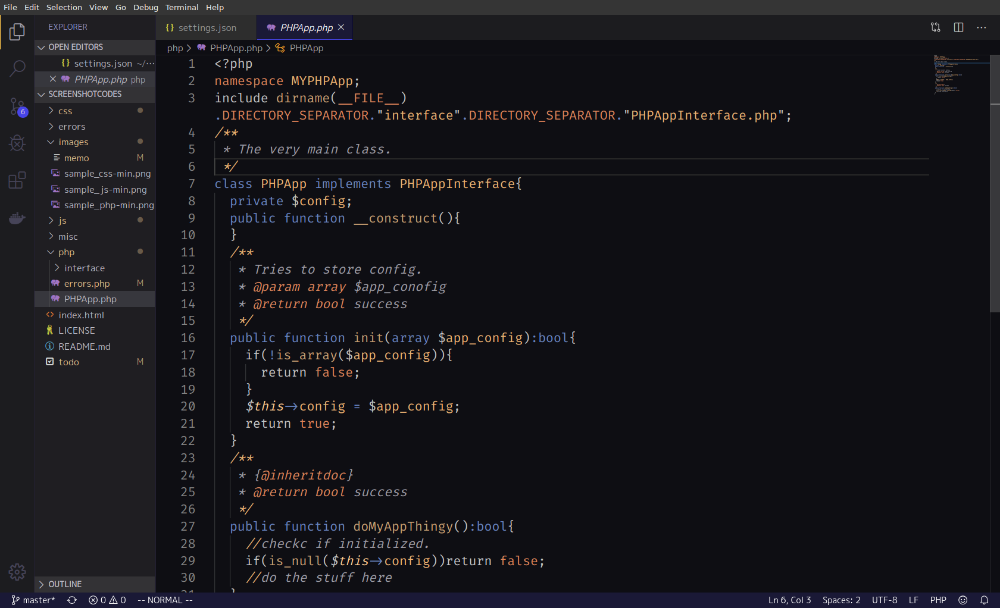

# "Night Cruise" color theme for VSCode
   
   
   
   
   
---
## Summary
An eye-friendly😎 dark theme for Visual Studio Code.
see [more information on github.io](https://ac34.github.io/VSCode-Night-Cruise/), or get it at the [Marketplace](https://marketplace.visualstudio.com/items?itemName=AC34.vscode-night-cruise).

## ⚠️Warning
This theme lets you be focused deeply. 
manage focus intervals and take some rests.

## ©️LICENSE
   

## 💬Announcement
This theme is still incomplete.
