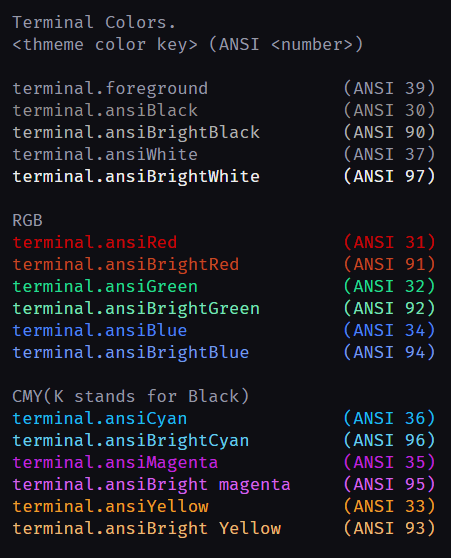

# "Night Cruise" color theme for VSCode
   
   
   
   
   
---
## ⚡Summary 
  An eye-friendly😎 dark theme prividing night-sky🌟 like vision for day and night coding🤘.
<h6 style="text-align:center">overview<h6>

<h6 style="text-align:center">terminal</h6>

---

## 👉Get it at 
   

## 💡Concept
####  Overview:
 Human kind has long been starring at the night-sky🌙, across any civilization you can enumerate.  
 The core idea💡 of this theme is to implement the familiar night-sky vision so that the theme is naturally eye-friendly😎 without distractions and cognitive overloads🧠.  
 Implementation is also carefully done with programmer's point of view🤖, so that colors are syntactically meaningful✨, emphasized and easy to distinguish between one another🚥.  
 Do you still want to keep starring at your theme just aimed at:
  - being dark
  - being colorful for the sake of being colorful
  - using author's favourite colors

 If not, this theme could be your solution.👍  
 **🆓Feel free to try!🆓**

#### 🖥️UI
   - Background
     - Deep blue. non-stimulative relaxing color.
   - Accent colors
     - Lighter blue than background. Some colors are close to purple.

#### 📓Editor
   - Backgroud
      - Deeper than UI blue.(easy to distinguish from other UI components)
   - Comment
      - Light gray. Not too bright, yet still easy to read.
   - language based keywords
      - Light blue.  language based keywords are always predictable.
      - Orange. This alternative color intends to distinguish from the other light blue, while still managint to stay lower than the main gold.
   - User defined keywords
      - Gold. This is the core part. A-star-in-the-night-sky-like gold. Your eyes are not catching those characters, but the colors are catching your eyes. This coloring makes it easier for you to face the display through the night.

## ⚠️Warning
This theme lets you be focused deeply. 
manage focus intervals and take some rests.

## ©️LICENSE
   

## 💬Announcement
This theme is still incomplete, I will revise on some colors.
